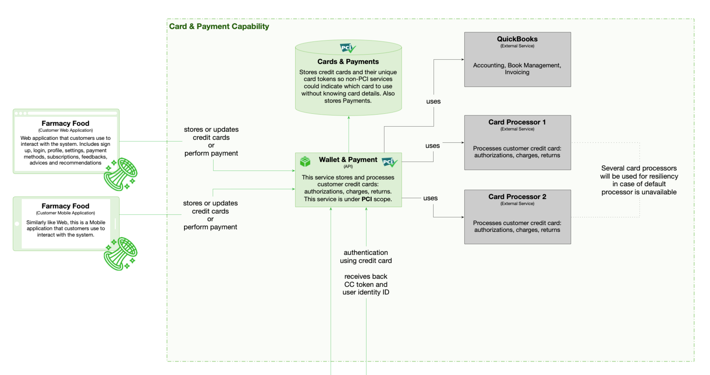

# Card And Payment

 
## Capability rationale and description  

To allow for customers to subscribe to meals and to pay for them both online and at the fridge, PCI-compatible wallet and card tokens storage must be introduced. The capability must support multiple card processors for high availability and fault tolerance. Elasticity is required for peak times, performance is a second concern. Customer identification tokens and cards can be issued. At the very detailed level this would also require __Encryption__ capability at the infrastructure level for encrypting highly sensitive data like card details and managing re-encryptions and key rotations periodically.

## Use cases

* Store and/or update credit cards tied to customer profiles.
* Allow issuing customer cards or tokens to identify at fridge without using credit cards. Such a token, for example, would be given to a child.

## Components

* Wallet & Payment API (PCI)
* Cards and Payments (PCI)

## Architectural characteristics

* Availability
* Fault Tolerance
* Performance
* Elasticity
* Security

## Architectural choice

* Microservice
