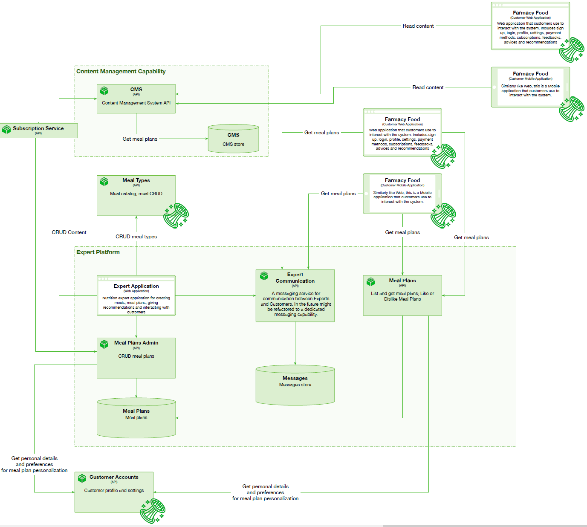

# Expert Platform and CMS

 

## Capability rationale and description

Expert Platform is where the health food experts and the customers meet. It rides upon a database of expert-crafted recipes in Meals Inventory, and another database of meal plans, which are sequences of recipes for meals intended for daily consumption over a period of time. The content and duration of each plan is variable and can be tailored to a concrete customer.
Experts log into the platform to create recipes and meal plans, and either send them privately to requesting customers through our messaging service, or publish them for a wider consumer audience on the content management system.
They can also use the same CMS to publish health food related articles for the audience, and so promote themselves and their expertize on our Platform.
Customers in turn can search, browse, list, like, save, or share the public meal plans via the Customer Meal Plan API, and also list and rank the experts, or contact an expert or an author of a specific meal plan they like, for a personally tailored plan or for dietary advice.
Granted express permission from customers, experts can gain access to customer's personal preferences (and health records when available in the future and compliant with HIPAA).
Experts, their recipes, and meals can all be ranked and commented on by the customers sharing health and food information and driving the experts to improve and produce more and healthier food plans.
The platform could be expanded to allow creating meal plans that are tailored for specific goal, like losing weight, or for a specific type of person, like diabetes, and allowing the customer to communicate with the meal plan author to share impressions, track goals and provide valuable feedback, fostering a community of health food experts and health food consumers.
In the future, the expert platform can be expanded into a full fledged social network of health-minded people and health food professionals, all serving each other for common good and supporting each other's healthy eating habbits.  

## Use cases

* Experts must be able to CRUD recipes and meal plans.
* Customers must be able to search, browse, list, like, save, or share the public meal plans.
* Customers must be able to contact, list and rank the experts.
* Customers can share personal profile with experts.
* Customer can create subsrciptions from expert meal plans.  

## Components

* Meal plans admin API. CRUD meal plans.
* Expert Communication API. A messaging service for communication between Experts and Customers. In the future might be refactored to a dedicated messaging capability. Could be 3rd party or external service.
* Meal Plans API. Allows to list, get, like or dislike meal plans.
* Messages store DB.
* Meal plans DB.
* Content Management System. Could be 3rd party or external service.

## Architectural characteristics

* Scalability.
* Elasticity.
* Fault Tolerance.
* Availability.

## Architectural choice

* Microservices.
