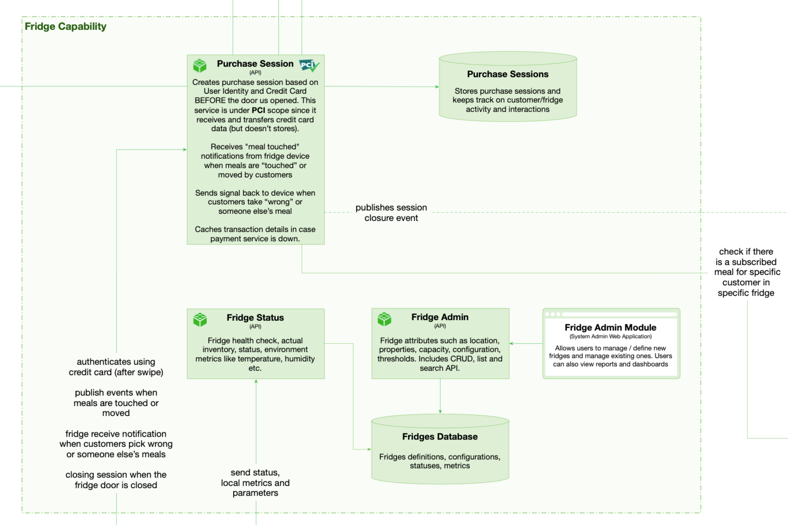

# Fridge Capability  

 

## Capability rationale and description

To allow more sophisticated operation than just payment for meal at the fridge, fridge API must be able to create a purchase session, that would connect the fridge, the inventory, the customer id, the payment, and also the referrals, expert ids and subscriptions if any.
The fridge must also report its status and inventory, as well as attempts of theft or unauthorised meal removal.
The fridge has area for "free for all" (FFA) meals, available to anyone, identified by barcode and a special area for subscription meals, which are identified by barcode, customer name, and a vivid sign.

## Use cases

* Anonimous customer opens the fridge by swiping a card, picks up a "free for all" meal or meals, closes the door, card is charged for meals taken.
* Subscribed customer opens the fridge by swiping a card, picks up his subscription meal and may also take some "free for all" meal or meals, closes the door, Purchase Session charged the card for meals taken.
* Subscribed customer opens the fridge by ID token, picks up his subscription meal and may also take some "free for all" meal or meals, closes the door, Purchase Session charged the card in customer wallet for meals taken.
* Anonymous customer takes a subscription meal, alarm is sounded. If customer persists, the card is charched and Purchase Session notifies system of theft.
* Subscriber customer takes a subscription meal of another customer, alarm is sounded. If customer persists, the card is charched and Purchase Session notifies system of theft and updates customer record. 

## Components

* Fridge Status API. Fridge health check, actual inventory, status, environment metrics like temperature, humidity etc.
* Fridge Admin API. Fridge attributes such as location, properties, capacity, configuration, thresholds. Includes CRUD, list and search API.
* Fridge Admin Web/Mobile App.
* Purchase Session API (PCI): 
    - Creates purchase session based on User Identity and Credit Card BEFORE the door us opened. This service is under PCI scope since it receives and transfers credit card data (but doesn’t store it).
    - Receives "meal touched" notifications from fridge device when meals are “touched” or moved by customers. 
    - Sends signal back to device when customers take “wrong” or someone else’s meal.
    - Caches transaction details in case payment service is down.
    - Publishes purchase finalization event that doubles as meal status message for the sake of Meals Inventory.
* Purchase Sessions DB.
* Fridges DB.

## Architectural characteristics

* Fault Tolerance
* Elasticity
* Scalability
* Testability

## Architectural choice

* Microservices
* Event Driven
