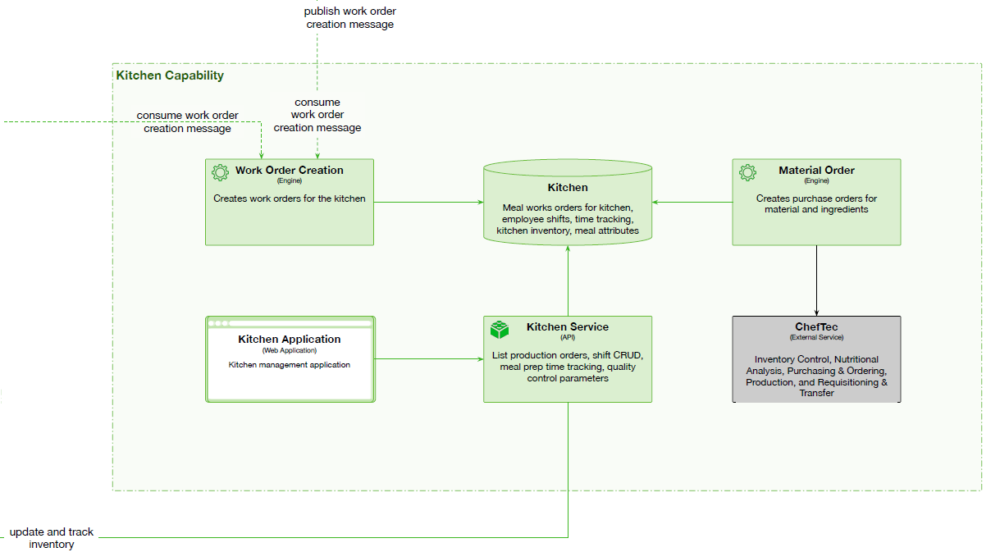

# Kitchens

 

## Capability rationale and description

The kitchen orders and delivery must become automated to handle customer demand and to support the subscription capability. It should also allow admin interface to monitor kitchen loads, orders inflow and outflow, and manage relevant supplies purchases. It's like manufacturing Shop Flow Control for managing the various components of the manufacturing process. At some point of time we might want to introduce automated quality control systems too and sensors to manage temperature, humidity and other parameters in Kitchen appliances. The __Kitchen Capability__ begins with manual work order creation by the admins, an expands with the addition of __Subscription Capablity__ to support automated work order creation. The capability interfaces with external services like ChefTech for Inventory Control, Nutritional Analysis, Purchasing & Ordering, Production, and Requisitioning & Transfer. Since Kitchen deals with food manufacturing, a sophisticated __security controls__ are required at the very detailed level of the architecture as well as __Role or Attribute Based Access__ capability.

## Use cases

* Creation of manual work orders.
* Creation of automated work orders from subscription.
* Order and manage supplies.
* Manage kitchen operations.
* Allows managing several kitchens in different locations.

## Components

* Kitchen Application for kitchen, orders and supplies management.
* Kitchen Service API. List production orders, shift CRUD, meal prep time tracking, quality control parameters.
* Work Order Creation engine. Creates work orders for the kitchen.
* Material Order engine. Creates purchase orders for material and ingredients.
* Kitchen DB. List production orders, shift CRUD, meal prep time tracking, quality control parameters. 

## Architectural characteristics

* Interoperability.
* Workflow.
* Integration.
* Single DB.
* Domain partitioning.

## Architectural choice

* Microservices 
* Service-oriented and message driven.
